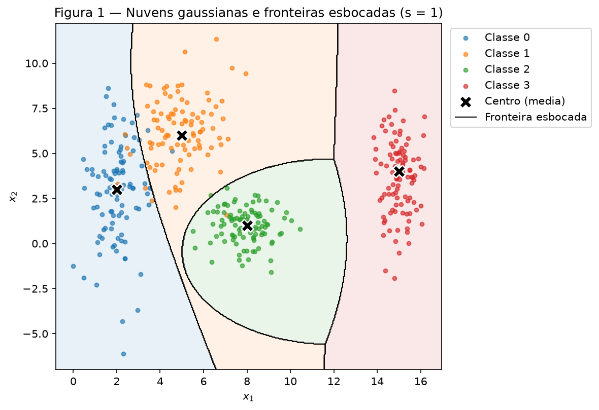
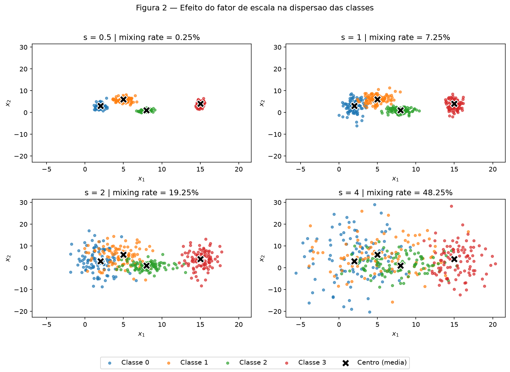
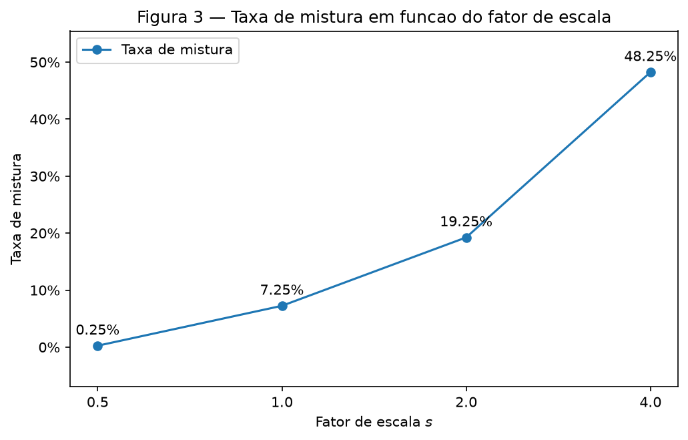
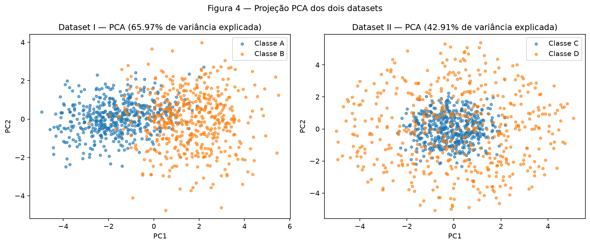
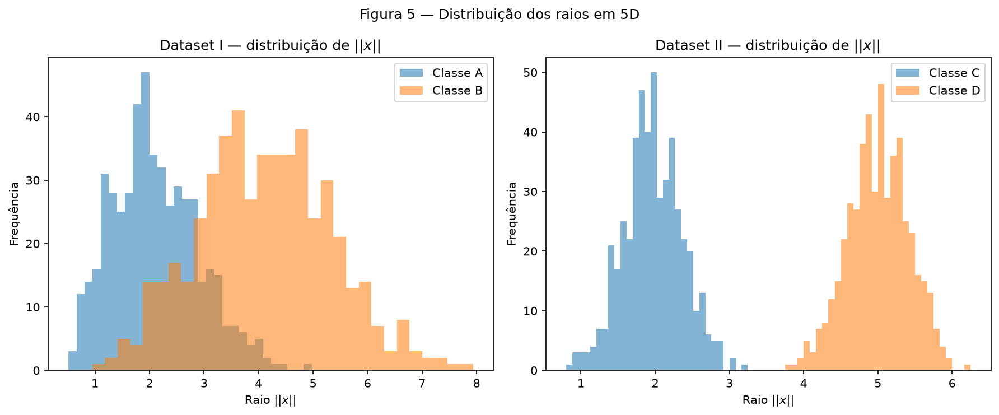
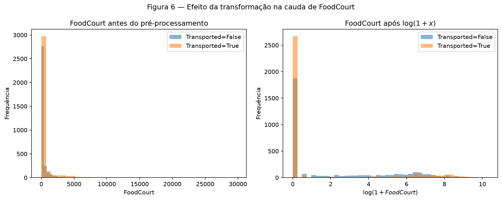

# 1. Data

!!! abstract "Enunciado"

    [Exercises → Data](https://insper.github.io/ann-dl/){:target='_blank'}

## Exercise 1 — Point Clouds: Geometry and Spread in 2D

**Abordagem.** Foram geradas quatro classes gaussianas em duas dimensões, com 100 pontos por classe, utilizando as médias e os desvios padrão definidos no enunciado. Para garantir a reprodutibilidade, foi utilizado o gerador `rng = np.random.default_rng(42)`.

Além do conjunto original, foram criadas quatro versões das mesmas classes usando os fatores de escala \(s = 0.5,\ 1,\ 2,\ 4\). As médias permanecem fixas e apenas os desvios padrão são multiplicados por \(s\). Para avaliar a separação entre as classes, foram calculados o *separation ratio* e a taxa de mistura. Nenhum modelo foi treinado.

**Código.** O script utilizado está em [`code/exercise1_point_clouds.py`](https://github.com/carolinaeskenazi/ann-dl/blob/main/docs/exercises/data/code/exercise1_point_clouds.py). Para reproduzir as figuras e os resultados, a partir da raiz do repositório:

```bash
python docs/exercises/data/code/exercise1_point_clouds.py
```

??? example "Código — `exercise1_point_clouds.py`"

    ``` { .python .copy .select linenums='1' title="docs/exercises/data/code/exercise1_point_clouds.py" }
    --8<-- "docs/exercises/data/code/exercise1_point_clouds.py"
    ```

### A — Generate the clouds

O conjunto original possui 400 amostras, sendo 100 de cada classe.

| Classe | Média \(\mu\) | Desvio padrão \(\sigma\) |
| :----: | :-----------: | :----------------------: |
|    0   |  \((2,\ 3)\)  |      \((0.8,\ 2.5)\)     |
|    1   |  \((5,\ 6)\)  |      \((1.2,\ 1.9)\)     |
|    2   |  \((8,\ 1)\)  |      \((0.9,\ 0.9)\)     |
|    3   |  \((15,\ 4)\) |      \((0.5,\ 2.0)\)     |


/// caption
**Figura 1** — As quatro classes no plano \((x_1,x_2)\), para \(s=1\). Os X pretos representam as médias das classes e as linhas mostram um esboço das regiões de decisão (item C).
///

As classes possuem formatos diferentes por causa dos desvios padrão. A classe 0, por exemplo, é mais espalhada no eixo \(x_2\), enquanto a classe 2 apresenta a mesma dispersão nos dois eixos e forma uma nuvem mais compacta.

### B — More or less spread out

Para analisar o efeito da dispersão, foram gerados quatro datasets usando

$$
s \in \{0.5,\ 1,\ 2,\ 4\}.
$$

As médias não mudam. Somente os desvios padrão são multiplicados pelo fator \(s\).


/// caption
**Figura 2** — As mesmas quatro classes com os desvios padrão multiplicados por \(s = 0.5,\ 1,\ 2,\ 4\). Todos os painéis utilizam os mesmos limites dos eixos.
///

Quanto maior o valor de \(s\), maior a dispersão dos pontos e maior a sobreposição entre as classes.

O *separation ratio* foi calculado por

$$
r_{ij}
=
\frac{\lVert \mu_i-\mu_j\rVert}
{\bar{\sigma}_i+\bar{\sigma}_j},
$$

em que

$$
\bar{\sigma}_k
=
\frac{\sigma_{k,x}+\sigma_{k,y}}{2}.
$$

Para \(s=1\), os desvios médios são

$$
\bar{\sigma}_0=1.65,\qquad
\bar{\sigma}_1=1.55,\qquad
\bar{\sigma}_2=0.90,\qquad
\bar{\sigma}_3=1.25.
$$

Os resultados obtidos para os seis pares foram:

| Par \((i,j)\) | \(\lVert\mu_i-\mu_j\rVert\) | \(\bar{\sigma}_i+\bar{\sigma}_j\) | \(r_{ij}\) |
| :-----------: | :-------------------------: | :-------------------------------: | :--------: |
|     (0, 1)    |            4.243            |                3.20               |  **1.326** |
|     (0, 2)    |            6.325            |                2.55               |    2.480   |
|     (0, 3)    |            13.038           |                2.90               |    4.496   |
|     (1, 2)    |            5.831            |                2.45               |    2.380   |
|     (1, 3)    |            10.198           |                2.80               |    3.642   |
|     (2, 3)    |            7.616            |                2.15               |    3.542   |

O menor valor é o do par **(0,1)**:

$$
r_{01}=1.326.
$$

Isso indica que as classes 0 e 1 possuem a menor separação entre seus centros em relação à sua dispersão.

Como as médias não mudam e os desvios são multiplicados por \(s\), o *separation ratio* é inversamente proporcional ao fator de escala. Portanto, em \(s=2\),

$$
r_{01}(s=2)
=
\frac{1.326}{2}
=
\mathbf{0.663}.
$$

Esse valor é obtido diretamente da fórmula, sem gerar novos pontos.

A taxa de mistura corresponde à fração dos pontos cujo centro de classe mais próximo não pertence à própria classe.

| \(s\) | Pontos misturados | Taxa de mistura |
| :---: | :---------------: | :-------------: |
|  0.5  |      1 / 400      |    **0.25%**    |
|   1   |      29 / 400     |    **7.25%**    |
|   2   |      77 / 400     |    **19.25%**   |
|   4   |     193 / 400     |    **48.25%**   |


/// caption
**Figura 3** — Taxa de mistura em função do fator de escala \(s\). A proporção de pontos mais próximos do centro de outra classe aumenta conforme as nuvens se espalham.
///

Em \(s=0.5\), praticamente não há mistura. Em \(s=1\), a taxa sobe para **7.25%**, mostrando que já existe sobreposição relevante entre algumas classes.

A partir de \(s=1\), algumas classes já deixam de ser perfeitamente separáveis por fronteiras lineares. Nesse ponto, o menor *separation ratio* é \(r_{01}=1.326\).

O valor de \(r_{ij}\) deve ser interpretado como uma medida de separação relativa, e não como um teste formal de separabilidade linear. Portanto, pode existir sobreposição mesmo quando \(r_{ij}>1\).

Em \(s=2\), o menor ratio cai para **0.663** e a taxa de mistura chega a **19.25%**. Em \(s=4\), o menor ratio é aproximadamente **0.331** e a taxa de mistura chega a **48.25%**.

### C — Analysis

Na configuração original, com \(s=1\), as classes apresentam diferentes níveis de sobreposição. A classe 3 permanece mais isolada, enquanto a maior dificuldade ocorre entre as classes 0 e 1, que possuem o menor *separation ratio*, \(r_{01}=1.326\).

A classe 0 possui maior dispersão no eixo vertical,

$$
\sigma_{0,y}=2.5,
$$

o que faz parte de seus pontos se estenderem na direção da classe 1.

Uma única reta não consegue separar quatro classes, pois divide o plano em apenas duas regiões. Um conjunto de fronteiras lineares consegue criar mais regiões, mas não garante separação perfeita quando existem pontos de diferentes classes ocupando regiões semelhantes.

As fronteiras desenhadas na Figura 1 foram construídas a partir das distribuições gaussianas conhecidas. Para cada região do plano foi verificada qual classe apresentava maior densidade. Nenhum modelo foi treinado.

Como as classes possuem dispersões diferentes, as fronteiras não precisam ser retas. Um Perceptron simples consegue aprender apenas uma fronteira linear, enquanto uma rede com camadas ocultas pode representar fronteiras não lineares mais complexas.

O efeito da dispersão aparece claramente nas taxas de mistura:

$$
0.25\%
\rightarrow
7.25\%
\rightarrow
19.25\%
\rightarrow
48.25\%.
$$

Ao mesmo tempo, o menor *separation ratio* diminui:

$$
2.652
\rightarrow
1.326
\rightarrow
0.663
\rightarrow
0.331.
$$

Assim, quando \(s\) aumenta, cresce a região em que pontos de classes diferentes ocupam o mesmo espaço. Uma rede mais flexível pode aprender uma fronteira melhor, mas não consegue eliminar completamente o erro causado pela própria sobreposição das distribuições.

---

## Exercise 2 — Non-Linearity in Higher Dimensions

**Abordagem.** Foram gerados dois conjuntos de dados com 1000 amostras em cinco dimensões. O Dataset I é composto por duas classes gaussianas multivariadas com médias e matrizes de covariância diferentes. O Dataset II é composto por duas cascas concêntricas, nas quais a informação mais importante para distinguir as classes é a distância até a origem.

Para visualizar os dados, foi utilizado PCA para projetar cada dataset de cinco para duas dimensões. As distâncias entre centros e os raios foram calculados diretamente no espaço original 5D. Nenhum modelo foi treinado.

**Código.** O script utilizado está em [`code/exercise2_non_linearity.py`](https://github.com/carolinaeskenazi/ann-dl/blob/main/docs/exercises/data/code/exercise2_non_linearity.py). Para reproduzir as figuras e os resultados:

```bash
python docs/exercises/data/code/exercise2_non_linearity.py
```

??? example "Código — `exercise2_non_linearity.py`"

    ``` { .python .copy .select linenums='1' title="docs/exercises/data/code/exercise2_non_linearity.py" }
    --8<-- "docs/exercises/data/code/exercise2_non_linearity.py"
    ```

### A — Dataset I: shifted Gaussians

O Dataset I possui 500 amostras da Classe A e 500 da Classe B.

As médias utilizadas são

$$
\mu_A=[0,0,0,0,0]
$$

e

$$
\mu_B=[1.5,1.5,1.5,1.5,1.5].
$$

As duas classes também possuem matrizes de covariância diferentes. A Classe B apresenta variâncias maiores e a relação entre as duas primeiras features muda de correlação positiva na Classe A para negativa na Classe B.

Isso significa que as classes diferem tanto pela posição dos centros quanto pela forma e orientação de sua dispersão no espaço.

### B — Dataset II: concentric shells

No Dataset II, inicialmente é gerado um vetor aleatório em cinco dimensões,

$$
v\sim\mathcal{N}(0,I_5),
$$

que é normalizado:

$$
u=\frac{v}{\lVert v\rVert}.
$$

Dessa forma, \(u\) fornece uma direção aleatória sobre a esfera unitária de \(\mathbb{R}^5\).

Para a Classe C, o raio é sorteado em torno de 2:

$$
\rho_C\sim\mathcal{N}(2.0,0.4),
$$

enquanto para a Classe D o raio é sorteado em torno de 5:

$$
\rho_D\sim\mathcal{N}(5.0,0.4).
$$

Cada ponto é então construído por

$$
x=\rho u.
$$

Os raios médios obtidos foram:

$$
\bar{\rho}_C=1.972
$$

e

$$
\bar{\rho}_D=5.005.
$$

Apesar de as duas classes estarem aproximadamente centradas na mesma região, elas ocupam faixas radiais muito diferentes.

### C — Visualize and compare


/// caption
**Figura 4** — Projeção dos dois datasets de cinco para duas dimensões usando PCA. Os dois primeiros componentes explicam **65.97%** da variância no Dataset I e **42.91%** no Dataset II.
///

A variância explicada pelas duas primeiras componentes foi:

| Dataset    |  PC1 + PC2 |
| ---------- | ---------: |
| Dataset I  | **65.97%** |
| Dataset II | **42.91%** |

O PCA preserva uma parcela maior da variância do Dataset I. Nesse caso, a diferença entre os centros cria uma direção importante de variação que pode ser capturada por uma transformação linear.

No Dataset II, a informação relevante é radial e não está concentrada em uma direção específica. Por isso, a projeção em apenas duas dimensões preserva menos da estrutura original.

As distâncias entre os centros, calculadas em cinco dimensões, foram:

$$
\boxed{d_I=3.228}
$$

e

$$
\boxed{d_{II}=0.266}.
$$


/// caption
**Figura 5** — Histogramas do raio \(\lVert x\rVert\), calculado no espaço original de cinco dimensões. No Dataset II, as Classes C e D apresentam distribuições radiais claramente separadas.
///

No Dataset II, a distância entre os centros é de apenas **0.266**, mesmo com raios médios de **1.972** e **5.005**. Isso mostra que observar apenas os centros não é suficiente para caracterizar a separação entre as classes.

### D — Analysis

No Dataset II, a distância entre os centros é próxima de zero, mas os histogramas dos raios são claramente separados. Isso mostra que a informação que diferencia as classes não está na posição média dos pontos, mas na distância até a origem.

Um separador linear em cinco dimensões corresponde a um hiperplano, que divide o espaço em dois semiespaços. Ele não consegue criar uma região fechada que envolva completamente a casca interna sem também incluir pontos da casca externa.

Por isso, essa estrutura não pode ser separada por uma única fronteira linear. Coletar mais dados não resolve o problema, pois a limitação está no formato da fronteira, e não na quantidade de amostras.

O fato de as classes parecerem misturadas na projeção PCA também não prova que elas sejam inseparáveis no espaço original. PCA é uma transformação linear e, no Dataset II, apenas **42.91%** da variância foi preservada pelas duas primeiras componentes.

Uma função simples que utiliza o raio consegue separar as classes:

$$
\lVert x\rVert^2
=
\sum_{i=1}^{5}x_i^2.
$$

Como as cascas estão concentradas em raios próximos de 2 e 5, foi utilizado o valor intermediário \(3.5\). Assim,

$$
f(x)=
\begin{cases}
C, & \sum_{i=1}^{5}x_i^2 \leq 12.25,\\
D, & \sum_{i=1}^{5}x_i^2 > 12.25.
\end{cases}
$$

Nos 1000 pontos gerados, essa regra apresentou:

$$
\boxed{0\text{ erros em }1000\text{ pontos}}.
$$

Isso confirma que o problema pode ser separado facilmente quando uma função não linear adequada é utilizada.

---

## Exercise 3 — Preparing Real-World Data for a Neural Network

**Abordagem.** Foi utilizado o arquivo `train.csv` do Spaceship Titanic. Primeiro foram analisados o equilíbrio da variável alvo, os tipos de atributos, os valores ausentes e a distribuição das variáveis relacionadas a gastos.

Depois, os dados foram divididos em treino e teste antes de qualquer transformação. Os valores numéricos ausentes foram preenchidos pela mediana do treino e os categóricos pela categoria mais frequente. Também foi criada a feature `TotalSpend`, foi aplicada a transformação \(\log(1+x)\) às variáveis de gastos, as variáveis categóricas foram convertidas com one-hot encoding e as numéricas foram escaladas para \([-1,1]\).

**Código.** O script utilizado está em [`code/exercise3_preprocessing.py`](https://github.com/carolinaeskenazi/ann-dl/blob/main/docs/exercises/data/code/exercise3_preprocessing.py). Para reproduzir os resultados:

```bash
python docs/exercises/data/code/exercise3_preprocessing.py
```

??? example "Código — `exercise3_preprocessing.py`"

    ``` { .python .copy .select linenums='1' title="docs/exercises/data/code/exercise3_preprocessing.py" }
    --8<-- "docs/exercises/data/code/exercise3_preprocessing.py"
    ```

### A — Get to know the data

O objetivo do Spaceship Titanic é prever a variável `Transported`, que indica se um passageiro foi transportado para outra dimensão.

O dataset possui **8693 passageiros**. A distribuição da variável alvo é:

| `Transported` | Quantidade |  Proporção |
| ------------- | ---------: | ---------: |
| False         |       4315 |     49.64% |
| True          |       4378 | **50.36%** |

A classe positiva representa **50.36%** dos dados, portanto o dataset é praticamente balanceado.

As variáveis numéricas são:

* `Age`
* `RoomService`
* `FoodCourt`
* `ShoppingMall`
* `Spa`
* `VRDeck`

As variáveis categóricas utilizadas no pré-processamento são:

* `HomePlanet`
* `CryoSleep`
* `Destination`
* `VIP`

`PassengerId`, `Cabin` e `Name` foram descartadas conforme solicitado no enunciado.

A quantidade de valores ausentes em cada coluna é:

| Coluna       | Ausentes | Percentual |
| ------------ | -------: | ---------: |
| PassengerId  |        0 |      0.00% |
| HomePlanet   |      201 |      2.31% |
| CryoSleep    |      217 |      2.50% |
| Cabin        |      199 |      2.29% |
| Destination  |      182 |      2.09% |
| Age          |      179 |      2.06% |
| VIP          |      203 |      2.34% |
| RoomService  |      181 |      2.08% |
| FoodCourt    |      183 |      2.11% |
| ShoppingMall |      208 |      2.39% |
| Spa          |      183 |      2.11% |
| VRDeck       |      188 |      2.16% |
| Name         |      200 |      2.30% |
| Transported  |        0 |      0.00% |

As estatísticas das colunas de gastos foram:

| Feature      |   Média | Mediana | Máximo |
| ------------ | ------: | ------: | -----: |
| RoomService  | 224.688 |   0.000 |  14327 |
| FoodCourt    | 458.077 |   0.000 |  29813 |
| ShoppingMall | 173.729 |   0.000 |  23492 |
| Spa          | 311.139 |   0.000 |  22408 |
| VRDeck       | 304.855 |   0.000 |  24133 |

Em todas as colunas, a mediana é zero enquanto a média é muito maior. Isso indica distribuições fortemente assimétricas à direita: muitos passageiros não possuem gastos, enquanto uma quantidade menor apresenta valores muito elevados.

### B — Split before you transform

Os dados foram divididos em **80% para treino e 20% para teste**, mantendo a proporção da variável `Transported`.

O resultado foi:

$$
n_{train}=6954
$$

e

$$
n_{test}=1739.
$$

O split foi realizado antes de qualquer imputação, encoding ou scaling. Essa ordem é importante porque todas essas transformações calculam estatísticas dos dados. Se o conjunto de teste fosse usado para calcular essas informações, haveria *data leakage*.

No conjunto de treino, antes de qualquer transformação, `FoodCourt` apresentou:

$$
\text{média}=452.611
$$

e

$$
\text{mediana}=0.000.
$$

A diferença entre os dois valores mostra novamente a forte assimetria da distribuição.

### C — Preprocess

Para as variáveis numéricas, os valores ausentes foram preenchidos pela **mediana do conjunto de treino**. A mediana foi escolhida por ser menos sensível a valores extremos.

Para as variáveis categóricas, foi utilizada a **categoria mais frequente do conjunto de treino**.

Os imputers foram ajustados somente no treino e depois aplicados ao teste.

As variáveis `HomePlanet`, `CryoSleep`, `Destination` e `VIP` foram transformadas com one-hot encoding.

O encoder utiliza:

```python
handle_unknown="ignore"
```

Assim, se uma categoria aparecer no teste e não tiver sido observada no treino, o código continua funcionando: essa categoria é codificada com zeros em todas as colunas one-hot da variável, e nenhuma coluna nova é criada.

Depois da imputação, foi criada:

$$
TotalSpend =
RoomService+
FoodCourt+
ShoppingMall+
Spa+
VRDeck.
$$

As colunas `Cabin`, `Name` e `PassengerId` foram removidas.

Para reduzir as caudas longas das variáveis de gastos, foi aplicada às cinco colunas de gastos e também a `TotalSpend`:

$$
x'=\log(1+x).
$$

O uso de \(1+x\) permite aplicar a transformação mesmo quando o gasto é igual a zero.

A transformação comprime os valores extremos e deixa a distribuição menos assimétrica. Isso ajuda uma rede com `tanh`, pois valores muito grandes podem fazer as ativações ficarem próximas de \(-1\) ou \(1\), onde o gradiente da função é pequeno.

Por fim, as variáveis numéricas foram escaladas para

$$
[-1,1]
$$

com `MinMaxScaler`, ajustado somente no treino.

Esse intervalo foi escolhido por ser compatível com a faixa de saída da função `tanh`. O scaler usa `clip=True`: valores do teste fora da faixa observada no treino são cortados em \(-1\) ou \(1\), por isso a faixa do teste também é exatamente \([-1,1]\). As colunas one-hot já estão em \(\{0,1\}\) e não passam pelo scaler.

### D — Verify and visualize


/// caption
**Figura 6** — Distribuição de `FoodCourt` antes e depois da transformação \(\log(1+x)\). A transformação reduz a influência dos valores extremos e comprime a longa cauda à direita.
///

As verificações finais apresentaram:

| Verificação        |     Treino |      Teste |
| ------------------ | ---------: | ---------: |
| `NaN` restantes    |      **0** |      **0** |
| Número de amostras |   **6954** |   **1739** |
| Número de features |     **17** |     **17** |
| Valor mínimo       | **-1.000** | **-1.000** |
| Valor máximo       |  **1.000** |  **1.000** |

As matrizes finais possuem:

$$
X_{train}.shape=(6954,17)
$$

e

$$
X_{test}.shape=(1739,17).
$$

Não restam valores ausentes e todos os valores estão em uma faixa compatível com `tanh`.

Entre as decisões de pré-processamento, a transformação das variáveis de gastos provavelmente é uma das que mais influencia o treinamento. Essas variáveis apresentam mediana zero, mas valores máximos muito altos. Sem a transformação logarítmica, poucos valores extremos poderiam ter influência excessiva. A combinação de \(\log(1+x)\) com o escalonamento deixa as entradas mais adequadas para a rede.

---

## Discussão

Os três exercícios mostram que a dificuldade de classificação depende diretamente da estrutura dos dados.

No Exercício 1, apenas aumentar a dispersão, sem alterar os centros das classes, fez a taxa de mistura passar de **0.25%** para **48.25%**. Isso mostra que a distância entre os centros não é suficiente para avaliar a dificuldade de separação.

O Exercício 2 reforça essa ideia. No Dataset II, os centros estão separados por apenas **0.266**, mas os raios das duas classes são muito diferentes. Uma fronteira baseada em \(\lVert x\rVert\) consegue separar perfeitamente os pontos gerados, enquanto uma única fronteira linear não consegue representar a estrutura concêntrica.

O PCA também mostrou que uma projeção em duas dimensões não representa necessariamente toda a informação existente no espaço original. No Dataset II, apenas **42.91%** da variância foi preservada pelas duas primeiras componentes.

Por fim, o Exercício 3 mostrou que dados reais trazem outros problemas além da geometria das classes, como valores ausentes, atributos categóricos, diferentes escalas e distribuições muito assimétricas. O pré-processamento precisa tratar esses problemas sem utilizar informações do conjunto de teste.

---

## Conclusão

A atividade mostrou que a distribuição dos dados influencia diretamente a complexidade da fronteira necessária para classificá-los.

Quando as classes são compactas e bem separadas, fronteiras simples podem funcionar bem. Conforme aumenta a sobreposição ou surgem estruturas como cascas concêntricas, fronteiras não lineares passam a ser necessárias.

Também ficou claro que reduzir a dimensionalidade pode esconder informações importantes e que dados reais precisam ser preparados corretamente antes de serem usados em uma rede neural.

A combinação de análise geométrica, redução de dimensionalidade e pré-processamento ajuda a entender não apenas qual modelo poderia ser utilizado, mas também quais características dos próprios dados tornam o problema mais simples ou mais difícil.

---

## Results summary

|  # | Item                                                           | Valor                                               |
| -: | -------------------------------------------------------------- | --------------------------------------------------- |
|  1 | Mixing rate em \(s=0.5\)                                       | **0.25%**                                           |
|  2 | Mixing rate em \(s=1.0\)                                       | **7.25%**                                           |
|  3 | Mixing rate em \(s=2.0\)                                       | **19.25%**                                          |
|  4 | Mixing rate em \(s=4.0\)                                       | **48.25%**                                          |
|  5 | Menor \(r_{ij}\) em \(s=1.0\), e qual par                      | **1.326 — par (0,1)**                               |
|  6 | Distância entre os centros — Dataset I                         | **3.228**                                           |
|  7 | Distância entre os centros — Dataset II                        | **0.266**                                           |
|  8 | Variância explicada PC1 + PC2 — Dataset I                      | **65.97%**                                          |
|  9 | Variância explicada PC1 + PC2 — Dataset II                     | **42.91%**                                          |
| 10 | Proporção da classe positiva em `Transported`                  | **50.36%**                                          |
| 11 | Média e mediana de `FoodCourt` no treino, antes de transformar | **452.611 e 0.000**                                 |
| 12 | Shape final da matriz de features de treino                    | **(6954, 17)**                                      |
| 13 | Mínimo e máximo de treino e teste após scaling                 | **Treino: [-1.000, 1.000]; Teste: [-1.000, 1.000]** |
