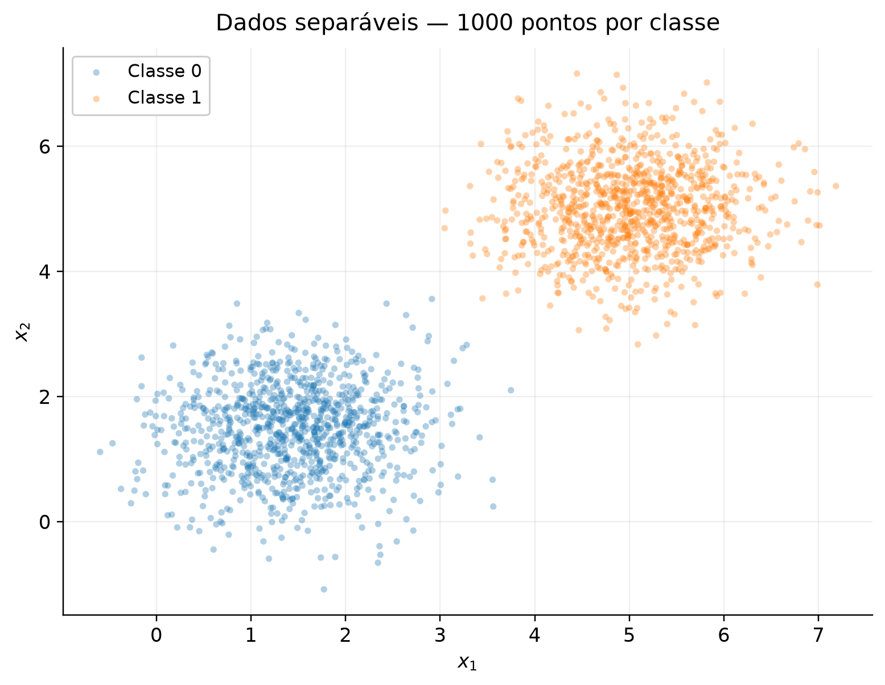
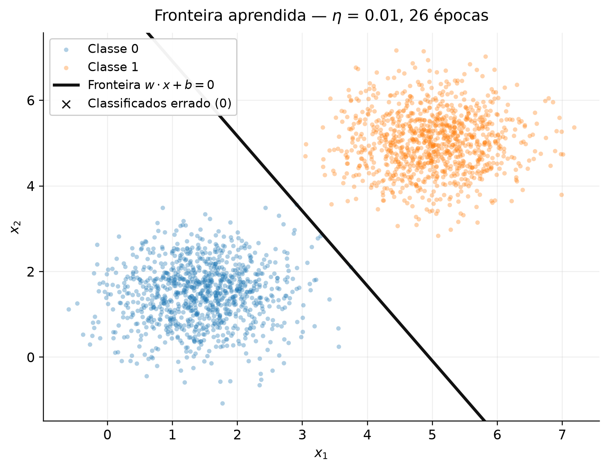
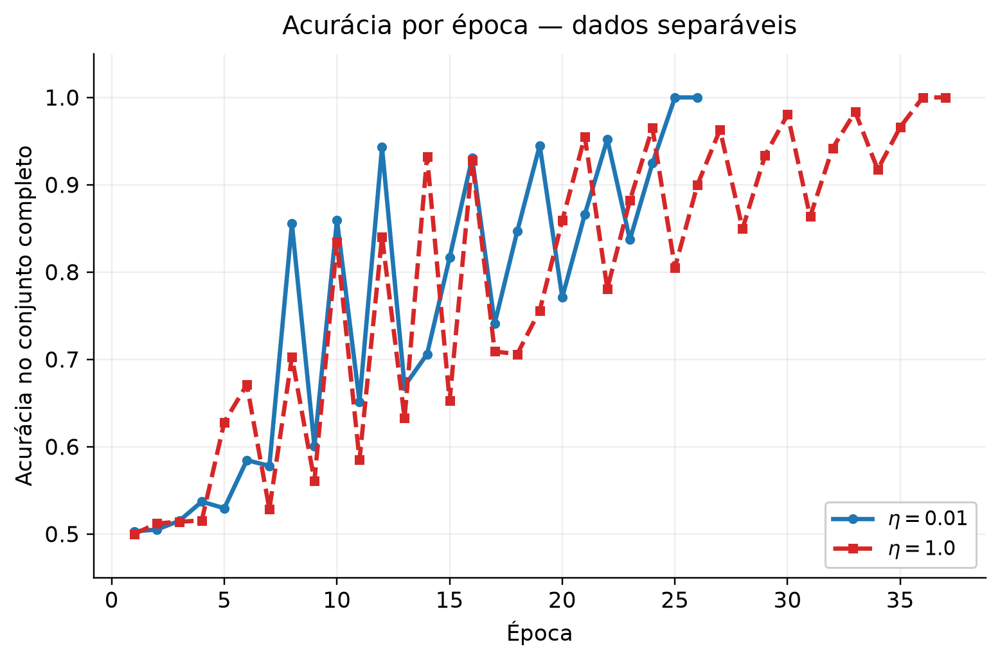
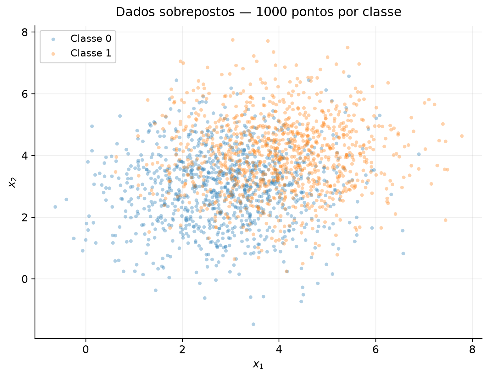
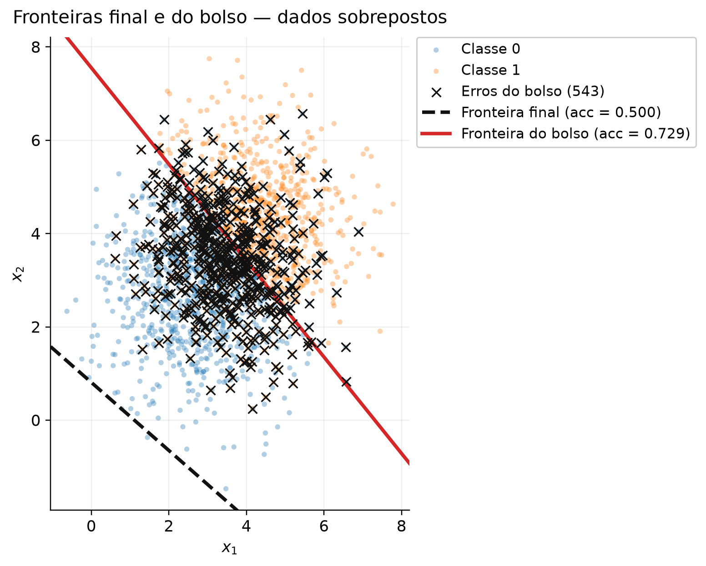
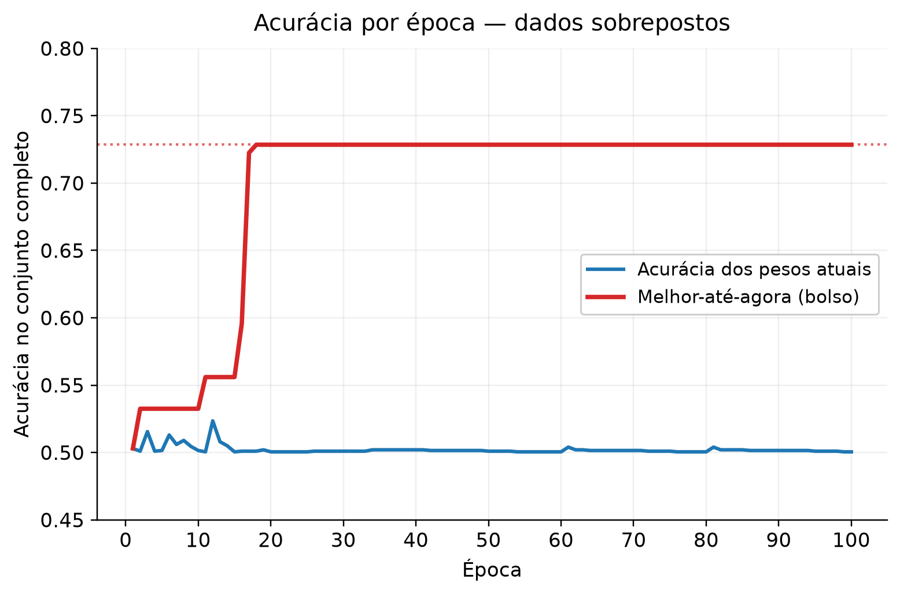

# 2. Perceptron

!!! abstract "Enunciado"

    [Exercises → Perceptron](https://insper.github.io/ann-dl/){:target='_blank'}

Nesta atividade, a ideia é ver na prática como o perceptron se comporta em duas situações diferentes: primeiro, com dados que podem ser separados por uma reta e, depois, com dados em que isso não é possível. Para comparar os dois casos, a mesma implementação é usada nos dois exercícios; no segundo, também é ativado o acompanhamento dos melhores pesos.

A implementação do modelo está em [`code/perceptron.py`](https://github.com/carolinaeskenazi/ann-dl/blob/main/docs/exercises/perceptron/code/perceptron.py) e é reutilizada nos dois exercícios. O arquivo [`code/plots.py`](https://github.com/carolinaeskenazi/ann-dl/blob/main/docs/exercises/perceptron/code/plots.py) reúne as funções usadas para gerar as figuras, como os gráficos dos dados, das fronteiras de decisão e dos pontos classificados incorretamente. Para garantir que os resultados possam ser reproduzidos, os experimentos utilizam `rng = np.random.default_rng(42)` na geração dos dados e na inicialização dos pesos.

---

## Exercise 1 — Separable Data

O código deste exercício está em [`code/exercise1_separable.py`](https://github.com/carolinaeskenazi/ann-dl/blob/main/docs/exercises/perceptron/code/exercise1_separable.py). Nele são gerados os dados do primeiro experimento, realizado o treinamento do perceptron e geradas as Figuras 1, 2 e 3. O script também mostra no terminal os principais resultados usados na análise, como os pesos finais, o bias, o número de épocas e a acurácia.

Para reproduzir o experimento, basta executar o script a partir da raiz do repositório:

```bash
python docs/exercises/perceptron/code/exercise1_separable.py
```

### A — Generate the data

#### Abordagem

Duas classes gaussianas em \(\mathbb{R}^2\), 1000 pontos cada:

| Classe |  Média \(\mu\)  | Covariância \(\Sigma\) | Amostras |
| :----: | :-------------: | :--------------------: | :------: |
|    0   | \((1.5,\ 1.5)\) |       \(0.5\,I\)       |   1000   |
|    1   |   \((5,\ 5)\)   |       \(0.5\,I\)       |   1000   |

Como o desvio padrão é \(\sigma=\sqrt{0.5}\approx0.707\), e a distância entre as médias é \(\lVert\mu_1-\mu_0\rVert=4.95\), os centros das duas classes ficam bem afastados em relação à dispersão dos dados. Por isso, as duas nuvens ficam separadas e podem ser divididas por uma reta.

Os 1000 pontos da classe 0 são colocados primeiro e, em seguida, os 1000 da classe 1. O treinamento percorre os pontos nessa mesma ordem e não faz embaralhamento.

#### Código

??? example "Código — `exercise1_separable.py` — parâmetros, geração e Figura 1"

    ``` { .python .copy .select }
    --8<-- "docs/exercises/perceptron/code/exercise1_separable.py:config"

    --8<-- "docs/exercises/perceptron/code/exercise1_separable.py:generate"

    --8<-- "docs/exercises/perceptron/code/exercise1_separable.py:data"

    --8<-- "docs/exercises/perceptron/code/exercise1_separable.py:fig1"
    ```

#### Figuras


/// caption
**Figura 1** — Os 2000 pontos, uma cor por classe. As nuvens ocupam regiões disjuntas do plano.
///

---

### B — Implement the perceptron

#### Abordagem

O perceptron foi implementado do zero em `perceptron.py`, usando apenas `numpy`. Para cada ponto, ele calcula \(w\cdot x+b\) e usa uma função degrau para decidir entre as classes 0 e 1. Se a previsão estiver errada, os pesos e o bias são ajustados para tentar corrigir o erro.

A predição é dada por

$$
\hat{y}=\text{step}(w\cdot x+b),
$$

onde a função degrau retorna 1 quando \(w\cdot x+b\geq0\) e 0 caso contrário.

Para corrigir os erros, foi utilizada a regra

$$
w\leftarrow w+\eta(y-\hat{y})x
$$

e

$$
b\leftarrow b+\eta(y-\hat{y}).
$$

Essa regra foi escolhida porque os rótulos do exercício são 0 e 1. Quando o modelo acerta, \(y-\hat{y}=0\) e nada muda. Quando erra, o valor fica positivo ou negativo e indica para que lado os pesos precisam ser corrigidos.

Os pesos começam pequenos e diferentes de zero, usando `rng.normal(0, 0.01, size=2)`, enquanto o bias começa em zero. O sorteio deste experimento produziu

$$
w_0 = [0.002532,\ 0.008952],
$$

$$
\lVert w_0\rVert = 0.009303.
$$

No primeiro treinamento, usamos \(\eta=0.01\). O treino continua até passar por todos os pontos sem precisar fazer nenhuma atualização ou até chegar ao limite de 100 épocas.

No item D, o mesmo \(w_0\) é mantido e o treinamento é repetido com \(\eta=1.0\). Dessa forma, conseguimos comparar as duas taxas sem mudar a inicialização.

No Exercício 2, a mesma classe é usada novamente. A diferença é que o treinamento recebe `pocket=True`, para guardar os melhores pesos encontrados ao longo do caminho e compará-los com os pesos que ficaram no final.

#### Código

??? example "Código — `perceptron.py` — ativação, modelo e laço de treino"

    ``` { .python .copy .select }
    --8<-- "docs/exercises/perceptron/code/perceptron.py:step"

    --8<-- "docs/exercises/perceptron/code/perceptron.py:result"

    --8<-- "docs/exercises/perceptron/code/perceptron.py:model"
    ```

??? example "Código — `plots.py` — cores e helpers de figura"

    ``` { .python .copy .select }
    --8<-- "docs/exercises/perceptron/code/plots.py:style"

    --8<-- "docs/exercises/perceptron/code/plots.py:helpers"
    ```

---

### C — Train and measure

#### Abordagem

Treino com \(\eta=0.01\) até a parada, registrando a acurácia no conjunto completo ao final de cada época.

#### Código

??? example "Código — `exercise1_separable.py` — treino e Figuras 2 e 3"

    ``` { .python .copy .select }
    --8<-- "docs/exercises/perceptron/code/exercise1_separable.py:train"

    --8<-- "docs/exercises/perceptron/code/exercise1_separable.py:fig2"

    --8<-- "docs/exercises/perceptron/code/exercise1_separable.py:fig3"
    ```

#### Resultados

| Quantidade          | Valor                                              |
| ------------------- | -------------------------------------------------- |
| \(w\) final         | \([0.050497,\ 0.028872]\)                          |
| \(b\) final         | \(-0.250000\)                                      |
| \(\lVert w\rVert\)  | \(0.058168\)                                       |
| Épocas até a parada | **26** (parou sozinho, 0 atualizações na época 26) |
| Acurácia final      | **1.0000** — 0 erros em 2000 pontos                |

A fronteira aprendida é, portanto,

$$
0.050497\,x_1 + 0.028872\,x_2 - 0.25 = 0.
$$

#### Figuras


/// caption
**Figura 2** — A reta \(w\cdot x + b = 0\) sobre os dados, ao final do treino com \(\eta=0.01\). Nenhum ponto foi classificado errado (a entrada "Classificados errado (0)" da legenda está vazia de propósito).
///


/// caption
**Figura 3** — Acurácia no conjunto completo ao final de cada época. A curva principal é a de \(\eta=0.01\); a tracejada é a rodada de comparação do item D, com \(\eta=1.0\). As duas oscilam e terminam em 100%, em 26 e 37 épocas.
///

A oscilação da Figura 3 vem da ordem das amostras: como a época termina no bloco da classe 1, os últimos erros corrigidos empurram a fronteira na direção dessa classe, e a foto tirada ao final da época pega o modelo sempre no mesmo ponto do ciclo. A tendência de subida, essa sim, é monótona no médio prazo — e a última época é a que não produz nenhuma atualização.

---

### D — Analysis

#### 1. Por que dados separáveis convergem rápido?

Os pontos que já estão classificados corretamente não provocam nenhuma mudança, porque \(y-\hat{y}=0\). Assim, o perceptron só modifica os pesos quando encontra um erro. Conforme a fronteira melhora, os erros ficam menos frequentes até desaparecerem completamente.

O número de atualizações por época, registrado pelo script, é

```text
[3, 3, 4, 4, 3, 4, 3, 4, 2, 4, 2, 4, 2, 3, 3, 3, 2, 3, 3, 2, 3, 3, 2, 3, 1, 0]
```

Ele termina em **0**, que é o critério de parada. Como existe uma faixa vazia entre as duas nuvens, basta que a reta caia dentro dela para que nenhuma amostra produza erro; a partir daí o laço percorre as 2000 amostras sem tocar em \(w\), e o treino acaba. É o resultado do teorema de convergência do perceptron: havendo uma margem \(\gamma>0\), o número **total** de erros é limitado por \((R/\gamma)^2\), então as atualizações necessariamente se esgotam.

#### 2. A mesma rodada com η = 1.0

|                                   | \(\eta = 0.01\)           | \(\eta = 1.0\)            |
| --------------------------------- | ------------------------- | ------------------------- |
| \(w\) final                       | \([0.050497,\ 0.028872]\) | \([5.870616,\ 3.359239]\) |
| \(b\) final                       | \(-0.250000\)             | \(-31.000000\)            |
| \(\lVert w\rVert\)                | \(0.058168\)              | \(6.763773\)              |
| \(w/\lVert w\rVert\)              | \([0.868123,\ 0.496349]\) | \([0.867950,\ 0.496652]\) |
| Ângulo de \(w\)                   | \(29.759^\circ\)          | \(29.779^\circ\)          |
| \(\lvert b\rvert/\lVert w\rVert\) | \(4.2979\)                | \(4.5832\)                |
| Épocas                            | 26                        | **37**                    |
| Acurácia                          | 1.0000                    | 1.0000                    |

As duas rodadas chegam a 100%, mas não chegam lá da mesma forma: uma para em 26 épocas e a outra em 37. Mesmo assim, as direções de \(w\) ficam praticamente iguais, com apenas \(0.020^\circ\) de diferença entre elas. O que muda mais é a posição da reta. Nas duas execuções, a fronteira termina dentro da região vazia entre as duas nuvens, mas em posições diferentes.

O que \(\eta\) controla é o **tamanho de cada correção em relação à inicialização**. Cada atualização soma \(\eta x\) a \(w\), e aqui \(\lVert x\rVert\) vale \(4.654\) em média:

$$
\eta = 0.01 \;\Rightarrow\; \eta\lVert x\rVert = 0.0465,
$$

$$
\eta = 1.0 \;\Rightarrow\; \eta\lVert x\rVert = 4.654.
$$

Contra \(\lVert w_0\rVert = 0.0093\), isso significa que na rodada lenta a inicialização vale cerca de **20%** de uma única correção, enquanto na rodada rápida vale **0.2%** — ou seja, \(\eta=1.0\) é, na prática, um começo do zero. É essa diferença de peso relativo que faz as duas trajetórias divergirem: erros diferentes são encontrados em ordens diferentes, e o processo termina em épocas diferentes, com \(\lVert w\rVert\) cerca de 116 vezes maior na rodada com \(\eta=1.0\). O que \(\eta\) **não** controla é a qualidade da solução: as duas separam o conjunto perfeitamente.

#### 3. E se a inicialização fosse w = 0, b = 0?

Sejam duas execuções completas do treino, uma com \(\eta\) e outra com \(\eta' = c\,\eta\), \(c>0\), ambas partindo de \(w^{(0)} = 0\) e \(b^{(0)} = 0\), sobre o mesmo conjunto na mesma ordem. Afirmação: em todo passo \(k\),

$$
w'^{(k)} = c\,w^{(k)}
$$

$$
b'^{(k)} = c\,b^{(k)}.
$$

**Base.** \(w'^{(0)} = 0 = c\cdot 0 = c\,w^{(0)}\), e o mesmo para \(b\).

**Passo.** Suponha a igualdade válida em \(k\) e considere a amostra \((x,y)\) visitada nesse passo. O argumento da ativação na segunda execução é

$$
z' = w'^{(k)}\!\cdot x + b'^{(k)} = c\,(w^{(k)}\!\cdot x + b^{(k)}) = c\,z.
$$

Como \(c>0\), \(z'\ge 0 \iff z\ge 0\) — inclusive no caso de igualdade, já que a função degrau usa \(z \ge 0\). Logo \(\hat{y}' = \hat{y}\), o erro \(e = y-\hat{y}\) é o mesmo, e

$$
w'^{(k+1)} = w'^{(k)} + \eta' e\,x
= c\,w^{(k)} + c\,\eta\,e\,x
= c\left(w^{(k)} + \eta\,e\,x\right)
= c\,w^{(k+1)},
$$

e igualmente \(b'^{(k+1)} = c\,b^{(k+1)}\). \(\blacksquare\)

Duas consequências:

* a fronteira é a mesma reta, porque \(\{x:\; c\,(w\cdot x + b) = 0\} = \{x:\; w\cdot x + b = 0\}\) para \(c>0\);
* como todas as predições coincidem passo a passo, as épocas têm exatamente as mesmas atualizações, a mesma curva de acurácia e a mesma contagem de épocas.

Partindo do zero, portanto, \(\eta\) só reescala \(w\) e \(b\) por um fator constante: não tem **nenhum** efeito sobre o que o modelo faz. É exatamente por isso que o item B proíbe o começo em zero — sem uma inicialização não nula, a comparação pedida no item D2 não teria o que comparar.

---

## Exercise 2 — Overlapping Data

O script deste exercício é [`code/exercise2_overlapping.py`](https://github.com/carolinaeskenazi/ann-dl/blob/main/docs/exercises/perceptron/code/exercise2_overlapping.py): ele gera as Figuras 4 a 6 e imprime os números citados abaixo. Para reproduzir:

```bash
python docs/exercises/perceptron/code/exercise2_overlapping.py
```

### A — Generate the data

#### Abordagem

Mesma geração, outros parâmetros:

| Classe | Média \(\mu\) | Covariância \(\Sigma\) | Amostras |
| :----: | :-----------: | :--------------------: | :------: |
|    0   |  \((3,\ 3)\)  |       \(1.5\,I\)       |   1000   |
|    1   |  \((4,\ 4)\)  |       \(1.5\,I\)       |   1000   |

Os centros agora estão a \(\lVert\mu_1-\mu_0\rVert = 1.414\) um do outro, com \(\sigma=\sqrt{1.5}\approx 1.22\): as nuvens se sobrepõem fortemente e nenhuma reta as separa.

#### Código

??? example "Código — `exercise2_overlapping.py` — parâmetros, geração e Figura 4"

    ``` { .python .copy .select }
    --8<-- "docs/exercises/perceptron/code/exercise2_overlapping.py:config"

    --8<-- "docs/exercises/perceptron/code/exercise2_overlapping.py:generate"

    --8<-- "docs/exercises/perceptron/code/exercise2_overlapping.py:data"

    --8<-- "docs/exercises/perceptron/code/exercise2_overlapping.py:fig4"
    ```

#### Figuras


/// caption
**Figura 4** — Os 2000 pontos. As duas classes ocupam praticamente a mesma região; só nas bordas inferior esquerda e superior direita uma delas domina.
///

---

### B — Train, keeping the best weights

#### Abordagem

A implementação do Exercício 1 é reutilizada **sem alteração**, com o mesmo \(\eta=0.01\), a mesma inicialização \(w_0 \sim \mathcal{N}(0,\,0.01)\) e o mesmo teto de 100 épocas. A única adição ao laço é a cópia do *pocket*: sempre que uma atualização produz uma acurácia maior do que qualquer uma já vista no conjunto completo, \((w, b)\) é copiado para o "bolso".

#### Código

??? example "Código — `exercise2_overlapping.py` — treino com o bolso"

    ``` { .python .copy .select }
    --8<-- "docs/exercises/perceptron/code/exercise2_overlapping.py:train"
    ```

#### Resultados

|                                   | Pesos finais (último iterado) | Pesos do bolso (melhor-até-agora) |
| --------------------------------- | ----------------------------- | --------------------------------- |
| \(w\)                             | \([0.036057,\ 0.049421]\)     | \([0.006841,\ 0.006620]\)         |
| \(b\)                             | \(-0.040000\)                 | \(-0.050000\)                     |
| \(\lVert w\rVert\)                | \(0.061176\)                  | \(0.009520\)                      |
| \(\lvert b\rvert/\lVert w\rVert\) | \(0.6538\)                    | \(5.2523\)                        |
| **Acurácia**                      | **0.5005**                    | **0.7285**                        |
| Erros                             | 999 de 2000                   | 543 de 2000                       |
| Época                             | 100 (última)                  | **18**                            |

O treino percorreu as 100 épocas sem nunca parar sozinho: não houve uma única passada sem atualização.

Como o enunciado antecipa, a acurácia dos pesos finais — **50.05%** — é o que se obteria chutando. Não é um bug: com esses pesos, 1999 dos 2000 pontos são classificados como classe 1. O item D explica por quê.

---

### C — Figures

#### Código

??? example "Código — `exercise2_overlapping.py` — Figuras 5 e 6"

    ``` { .python .copy .select }
    --8<-- "docs/exercises/perceptron/code/exercise2_overlapping.py:fig5"

    --8<-- "docs/exercises/perceptron/code/exercise2_overlapping.py:fig6"
    ```

#### Figuras


/// caption
**Figura 5** — As duas fronteiras sobre os mesmos pontos. A do bolso (vermelha) corta o meio da nuvem; a final (preta, tracejada) passa pelo canto inferior esquerdo, fora dos dados. Os X marcam os 543 pontos que a fronteira do **bolso** erra — os erros da fronteira final seriam 999 pontos, metade da figura, e não caberiam de forma legível.
///


/// caption
**Figura 6** — Acurácia por época. A curva azul é a dos pesos correntes ao final de cada época; a vermelha é a melhor acurácia já vista (o bolso), que congela em 0.7285 a partir da época 18. O eixo vertical foi cortado em \([0.45,\ 0.80]\) — na escala cheia a oscilação da curva azul seria invisível.
///

---

### D — Analysis

#### 1. Por que os pesos finais são tão piores que os do bolso?

Para essas duas gaussianas, a fronteira ótima entre as distribuições tem acurácia populacional teórica de aproximadamente 71,81%. No conjunto de 2000 pontos usado aqui, o pocket chegou a **0.7285**, que fica próximo desse valor. Já os pesos finais ficaram em **0.5005**.

A principal diferença está na **posição** da reta final. Uma fronteira \(w\cdot x + b = 0\) fica a uma distância \(\lvert b\rvert/\lVert w\rVert\) da origem, medida ao longo de \(\hat{w}\). Projetado sobre a direção \(\hat{w}\) dos pesos finais, o centro do conjunto — o ponto médio \((3.5,\ 3.5)\) entre as duas médias — está em \(4.890\), mas a fronteira está em \(0.654\). Ela passa perto da origem, muito antes de os dados começarem: é a reta tracejada no canto inferior esquerdo da Figura 5. Com todos os pontos do mesmo lado, tudo vira classe 1 e a acurácia cai para o acaso.

A reta acaba nessa posição porque \(w\) e \(b\) mudam em ritmos diferentes. A cada erro, temos

$$
\lVert \Delta w\rVert = \eta\,\lVert x\rVert = 0.01 \times 5.069 = 0.0507,
$$

$$
\lvert \Delta b\rvert = \eta = 0.01.
$$

O vetor de pesos avança cerca de \(\lVert x\rVert \approx 5\) vezes mais rápido que o bias. Só que, para a reta cruzar o meio da nuvem, é preciso \(b \approx -w\cdot\mu\), isto é, \(\lvert b\rvert \approx 4.9\,\lVert w\rVert\) — o viés precisaria ser cerca de cinco vezes **maior** que a norma dos pesos, enquanto cresce cinco vezes mais devagar. Como os erros das duas classes se alternam e \(b\) oscila em torno de zero (terminou em \(-0.04\)) enquanto \(\lVert w\rVert\) só acumula (de \(0.0095\) na época 18 para \(0.0612\) na época 100), a razão \(\lvert b\rvert/\lVert w\rVert\) **encolhe** com o tempo e a fronteira é empurrada para longe da nuvem.

O bolso, por outro lado, guardou um instante do início do treino — época 18 — em que \(\lVert w\rVert\) ainda era pequeno e \(b=-0.05\) dava \(\lvert b\rvert/\lVert w\rVert = 5.25\), quase exatamente a projeção do centro do conjunto naquela direção (\(4.949\)). Naquele momento a reta cortava os dados pelo meio. O laço não tinha como saber disso e seguiu em frente; sem a cópia, essa solução estaria perdida.

#### 2. Figura 3 contra Figura 6

Na Figura 3 a acurácia oscila, sobe e **estabiliza** em 1.0 — e o treino para sozinho na época 26, quando uma passada inteira não produz nenhuma atualização. Na Figura 6 nada disso acontece: a acurácia dos pesos correntes fica presa entre **0.5005 e 0.5235** (média 0.5020) pelas 100 épocas, e o treino é interrompido pelo teto, não por convergência.

O treino nunca chega a uma época com zero atualizações. Nas cinco primeiras épocas foram feitas `[2, 4, 3, 2, 2]` atualizações e, nas cinco últimas, 4 em todas elas. Por isso, o critério de convergência nunca é atingido dentro das 100 épocas.

O **teorema de convergência do perceptron** garante que, *se* existir um \(w^\*\) que classifica todas as amostras corretamente com margem \(\gamma>0\), e se \(\lVert x\rVert \le R\), então o algoritmo comete no máximo \((R/\gamma)^2\) erros no total — e portanto para depois de um número finito de passadas.

Aqui, a hipótese que não vale é a de separabilidade linear. As duas classes se sobrepõem, então sempre existe algum ponto que fica do lado errado de qualquer reta. Por isso o perceptron continua encontrando erros e nunca consegue fazer uma época completa sem atualização.

#### 3. Mais épocas resolvem? E um η menor?

**Mais épocas não resolvem.** O problema é que continuar treinando não muda o fato de que os dados não são separáveis. Sempre que aparece um ponto classificado errado, o perceptron faz uma nova correção de tamanho cheio, \(\eta(y-\hat{y})x\), mesmo que a fronteira já esteja em uma posição boa. Em dados sobrepostos sempre existem pontos do lado errado de qualquer reta — inclusive da melhor delas. Então as atualizações continuam destruindo boas soluções para sempre. Mais épocas só dão mais oportunidades para o bolso encontrar uma solução melhor; neste caso, ele parou de melhorar na época 18 e ficou 82 épocas sem avanço.

**Um \(\eta\) menor também não resolve.** Ele apenas deixa as correções menores e pode mudar o caminho seguido pelo treinamento. A dificuldade principal continua a mesma: como não existe uma reta que separe todas as amostras, alguns erros sempre vão aparecer.

O caso em que \(\eta\) apenas reescala toda a trajetória é o caso específico analisado no D3 do Exercício 1, com \(w_0=0\) e \(b_0=0\). Aqui a inicialização é não nula, então \(\eta\) pode alterar a trajetória. Mesmo assim, nenhum valor menor de \(\eta\) muda a propriedade fundamental do conjunto: não existe uma reta que classifique todas as amostras corretamente.

Então, aumentar o número de épocas ou diminuir a taxa de aprendizado não resolve a causa do problema. Para lidar melhor com dados não separáveis, é preciso usar uma estratégia que aceite a existência de erros, como o pocket, ou outro modelo/função de perda mais adequado.

---

## Discussão

Os dois exercícios usam a mesma implementação, mas os dados são bem diferentes, e isso já é suficiente para mudar completamente o comportamento do perceptron.

No primeiro conjunto, o perceptron consegue encontrar uma reta que separa os pontos. Por isso, depois de algumas correções, os erros desaparecem e o treinamento para em 26 épocas. Quando usamos \(\eta=1.0\), os pesos ficam em uma escala muito maior e o caminho muda, mas o resultado final continua sendo 100% de acurácia.

No segundo conjunto acontece o contrário. Como as classes se sobrepõem, o perceptron nunca consegue ficar sem erros. Ele continua atualizando os pesos e pode passar por uma solução razoavelmente boa antes de se afastar dela novamente. Foi o que aconteceu aqui: o pocket encontrou 72.85% de acurácia, mas o último conjunto de pesos terminou com apenas 50.05%.

O pocket não muda a regra de atualização do perceptron. Ele só evita perder uma solução boa que apareceu durante o treinamento. Neste caso, ele guarda 0.7285 de acurácia, enquanto o último iterado termina em 0.5005.

---

## Conclusão

No fim, o que mais importa é a separabilidade dos dados. Quando existe uma reta capaz de separar as classes, o perceptron consegue convergir. Quando isso não acontece, mudar a taxa de aprendizado ou simplesmente treinar por mais épocas não resolve o problema.

A comparação entre os dois exercícios também mostra por que olhar apenas para os pesos finais pode ser enganoso. No conjunto não separável, uma solução melhor pode aparecer durante o treinamento e desaparecer depois, como aconteceu com os 72.85% encontrados pelo pocket. A posição da fronteira também ajuda a entender esse comportamento, já que \(w\) e \(b\) são alterados de forma diferente a cada erro.

Assim, a limitação do Exercício 2 não está apenas no treinamento, mas no próprio tipo de fronteira que o perceptron consegue representar: uma única reta não consegue separar as duas nuvens sobrepostas.

---

## Results summary

|  # | Quantidade                                               | Valor                                            |
| -: | -------------------------------------------------------- | ------------------------------------------------ |
|  1 | Exercício 1 — \(w\) e \(b\) finais                       | \(w = [0.050497,\ 0.028872]\), \(b = -0.250000\) |
|  2 | Exercício 1 — épocas até a convergência                  | **26**                                           |
|  3 | Exercício 1 — acurácia final                             | **1.0000** (0 erros em 2000)                     |
|  4 | Exercício 1 — épocas e acurácia final com \(\eta = 1.0\) | **37 épocas**, acurácia **1.0000**               |
|  5 | Exercício 2 — \(w\) e \(b\) finais                       | \(w = [0.036057,\ 0.049421]\), \(b = -0.040000\) |
|  6 | Exercício 2 — acurácia dos pesos finais                  | **0.5005**                                       |
|  7 | Exercício 2 — acurácia dos pesos do bolso                | **0.7285**                                       |
|  8 | Exercício 2 — época em que o bolso atingiu o melhor      | **18**                                           |

Todos os números acima são impressos pelos próprios scripts e reproduzem a partir da semente `np.random.default_rng(42)`.
